# AgainstOTE: a 3D molecular generation model against off-target effects

The preview of the model architecture can be viewed as below. For exploring the implementation of this model, please follow the guidelines in next sections.

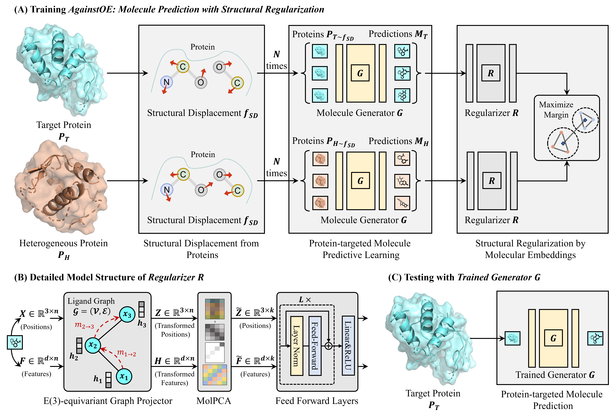

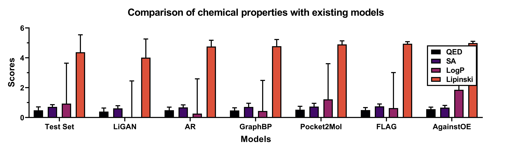

This model takes the pocket as input, produces multiple plausible molecules highly likely binding to the target.

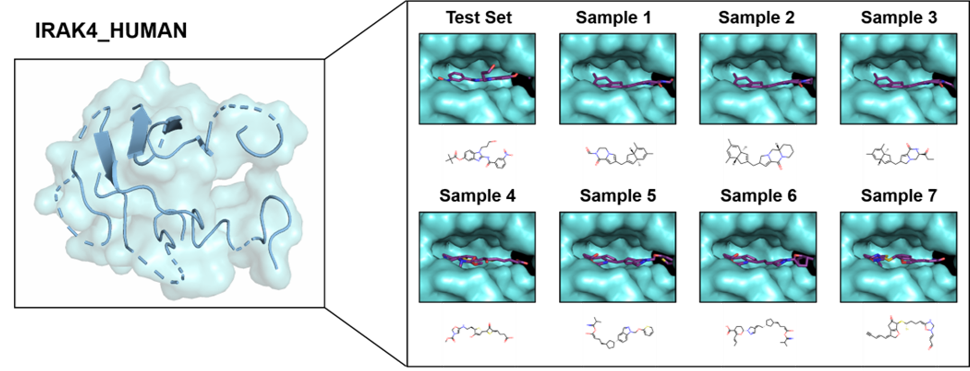

**🍇 Updates**
- **`2024/07/xx`** Guidelines for reproducing pre-experiments and formal experiments.
- **`2024/07/11`** Release code, pretrained weights and data. Basic deployment for future support.

## 1. Installation
Clone the repository locally:
```bash
git clone https://github.com/miaomiaoToday/AgainstOTE-master.git
```
Install via conda yaml file (cuda 11.3)
```bash
conda env create -f env_cuda113.yml
conda activate MolPred-AOE

copy env_adt.yml to ./
conda env create -f env_adt.yml
conda install -c conda-forge qvina
```

## 2. Data Preparation
Download the data collection we used from the [website](https://zenodo.org/records/10642766)
The downloaded `crossdocked_pocket10.zip` is ready for unzipping in the `data` folder. The unzipped
data in the folder should be like this format:

```bash
DATA
└─crossdocked_pocket10
    ├─1433B_HUMAN_1_240_pep_0
    ├─1433C_TOBAC_1_256_0
    ├─...
└─crossdocked_pocket10_name2id.pt
└─crossdocked_pocket10_processed.lmdb
└─split_by_name.pt
└─test_list.tsv
```

With the respect to the source of dataset, if this data is helpful, please also cite:
```bash
@article{francoeur2020three,
  title={Three-dimensional convolutional neural networks and a cross-docked data set for structure-based drug design},
  author={Francoeur, Paul G and Masuda, Tomohide and Sunseri, Jocelyn and Jia, Andrew and Iovanisci, Richard B and Snyder, Ian and Koes, David R},
  journal={Journal of chemical information and modeling},
  volume={60},
  number={9},
  pages={4200--4215},
  year={2020},
  publisher={ACS Publications}
}
```

## 3. Generating Molecules with Trained AgainstOTE
To generate the molecules, the pre-trained [weights](https://zenodo.org/records/12722246) 
should be downloaded and placed in `ckpt` folder. Specifically, `pretrained-AgainstOTE.pt`
is the final-version trained weights of ours.

To sample molecules for the i-th pocket in the testset, please run the following command:

```bash
python sample_single.py --data_id {i} --outdir ./outputs  # Replace {i} with the index of the data. i should be between 0 and 99 for the testset.
```

It is recommended to specify the GPU device number and restrict the cpu cores using command like:

```bash
CUDA_VISIBLE_DIVICES=0  taskset -c 0 python sample_single.py --data_id 0 --outdir ./outputs
```

A bash file `batch_sample.sh` for sampling all molecules for the whole test set in parallel. 
is provided. E.g.,

```bash
CUDA_VISIBLE_DEVICES=0 taskset -c 0 bash batch_sample.sh  3 0 0

CUDA_VISIBLE_DEVICES=0 taskset -c 1 bash batch_sample.sh  3 1 0

CUDA_VISIBLE_DEVICES=0 taskset -c 2 bash batch_sample.sh  3 2 0
```

The three parameters of `batch_sample.py` represent the number of workers, the index of current worker and the start index of the datapoint in the test set, respectively.

Generated mols visualization,

|                  example 1                   |                   example 2                   |                   example 3                   |                  example 4                   |
|:--------------------------------------------:|:---------------------------------------------:|:---------------------------------------------:|:--------------------------------------------:|
| 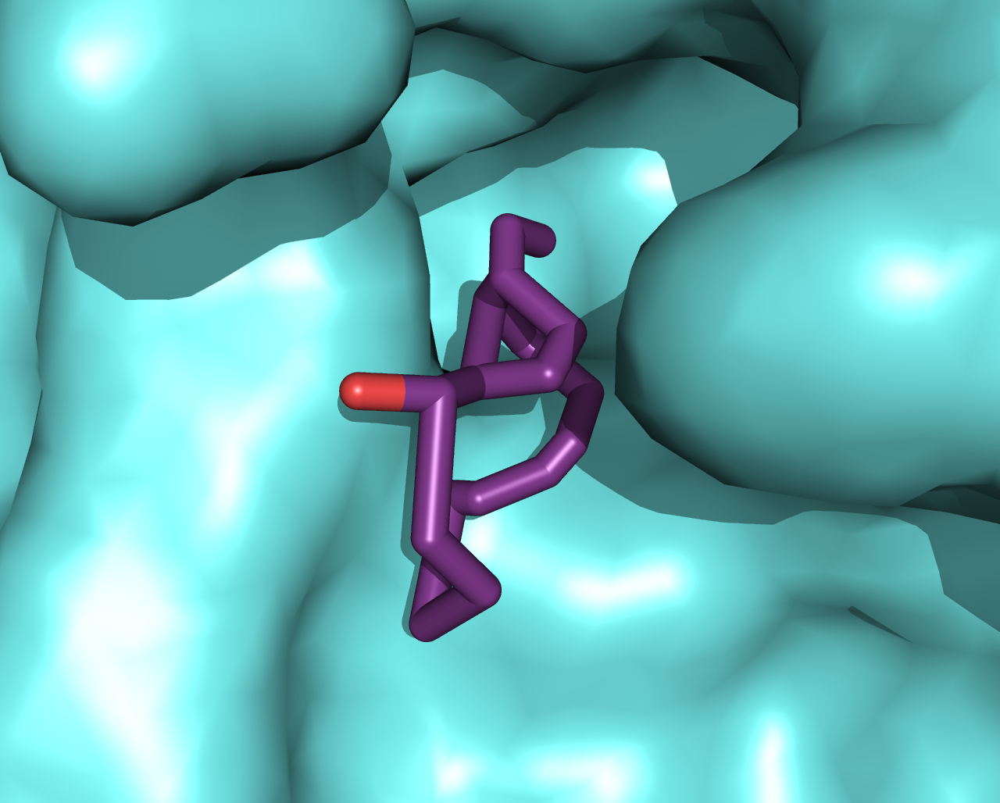  |  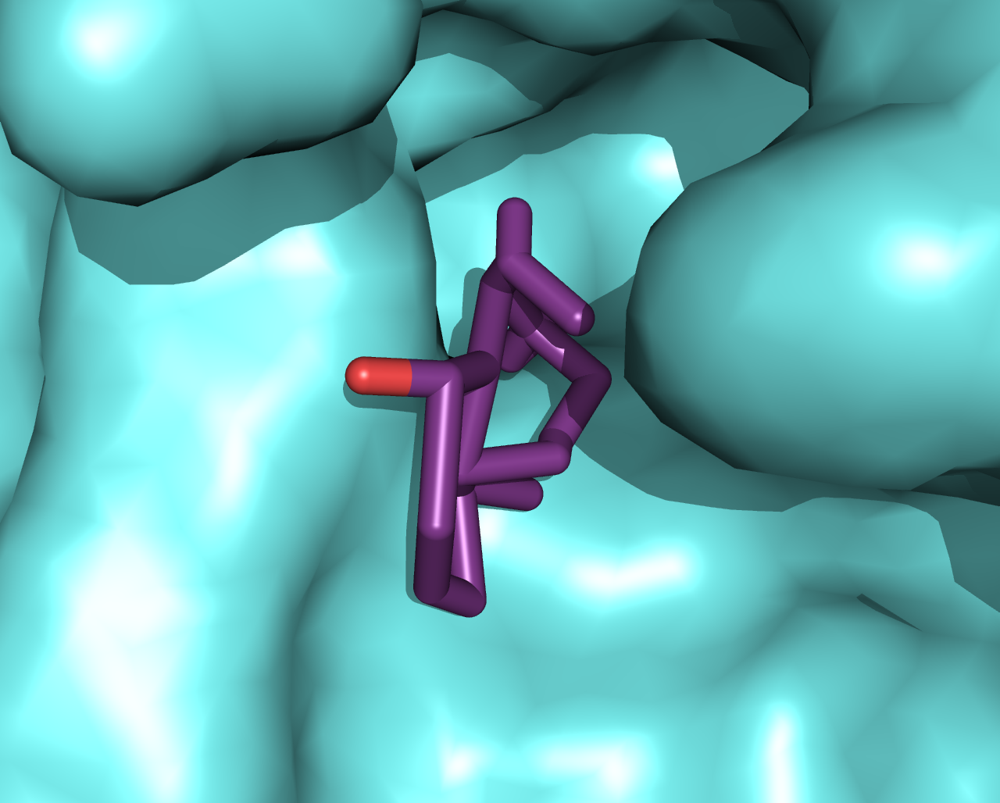  | 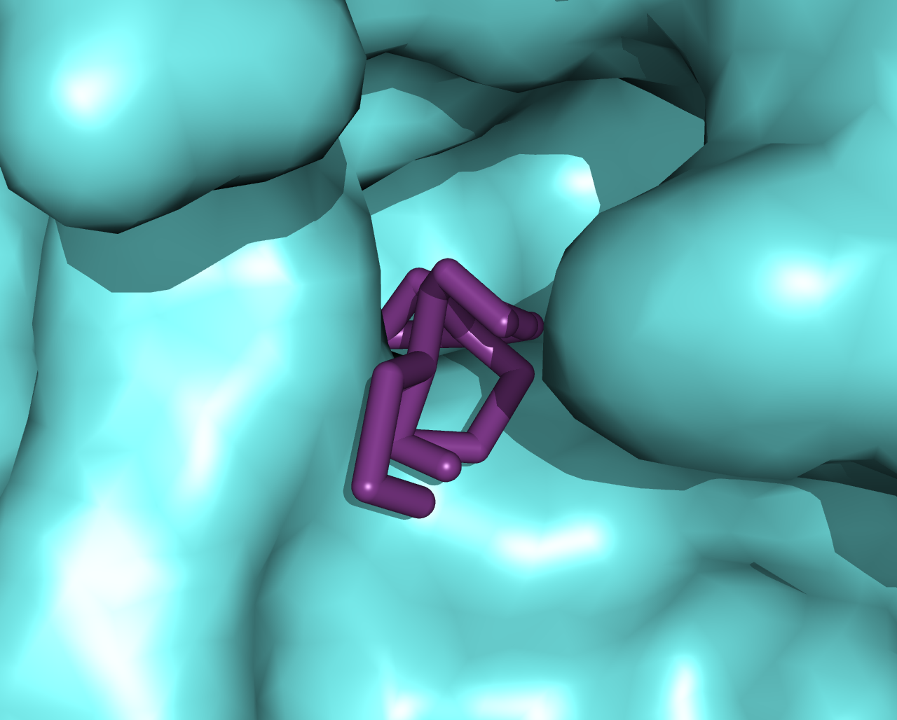  | 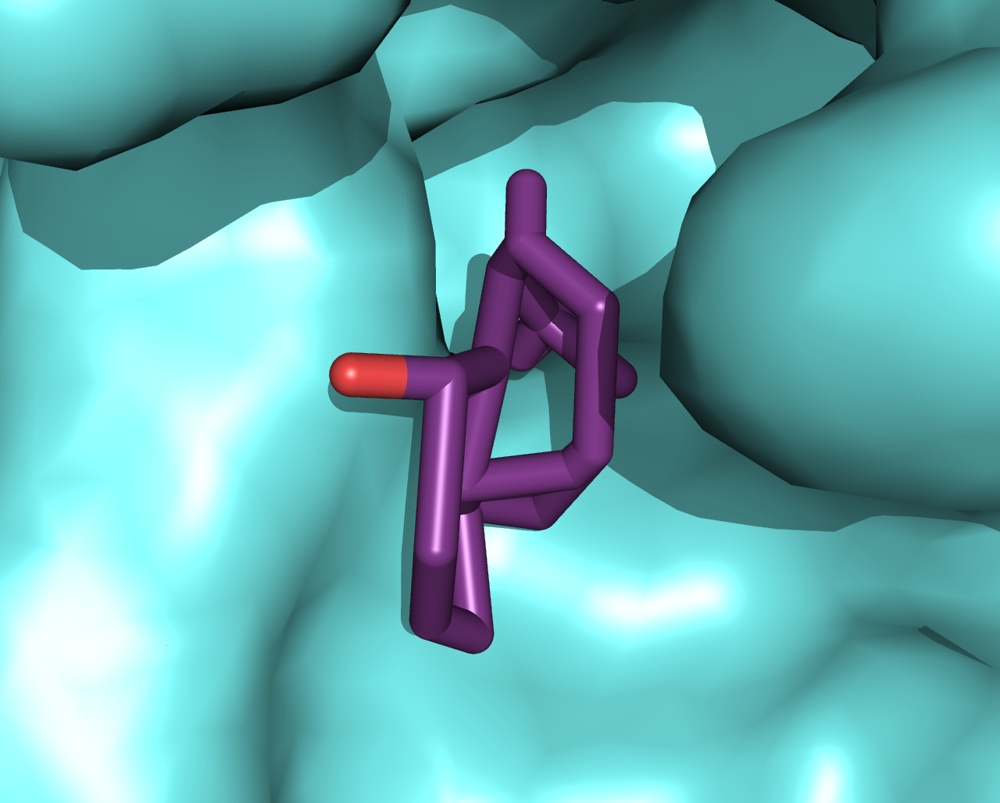 |      
|          example 5                           |                   example 6                   |                   example 7                   |                  example 8                   |
| 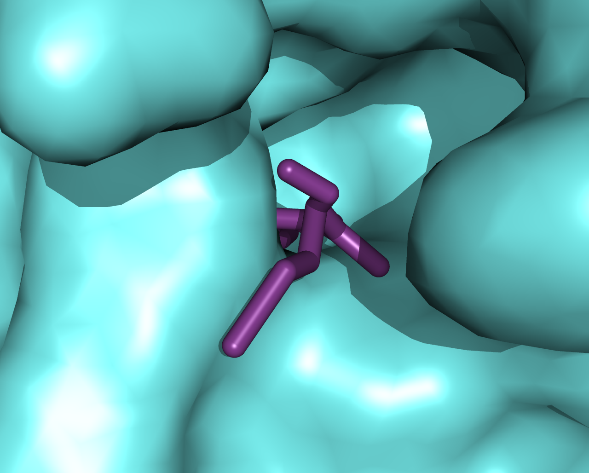  | 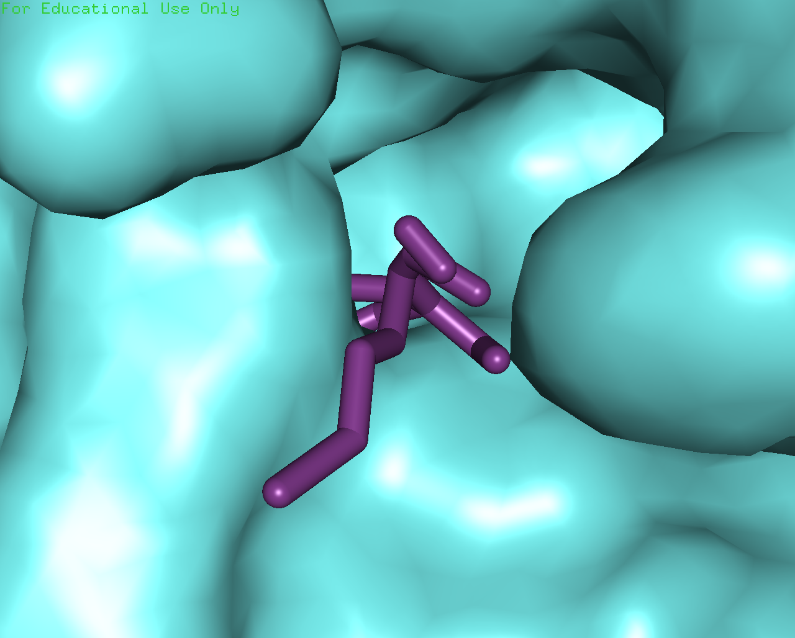   |  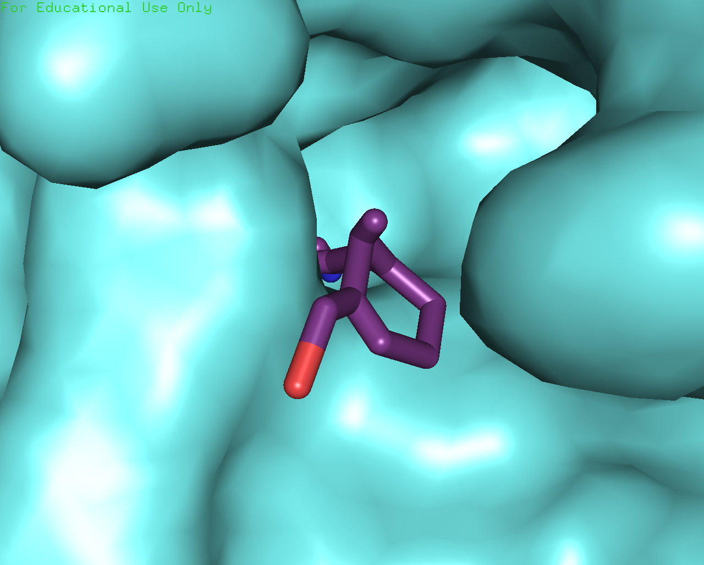  | 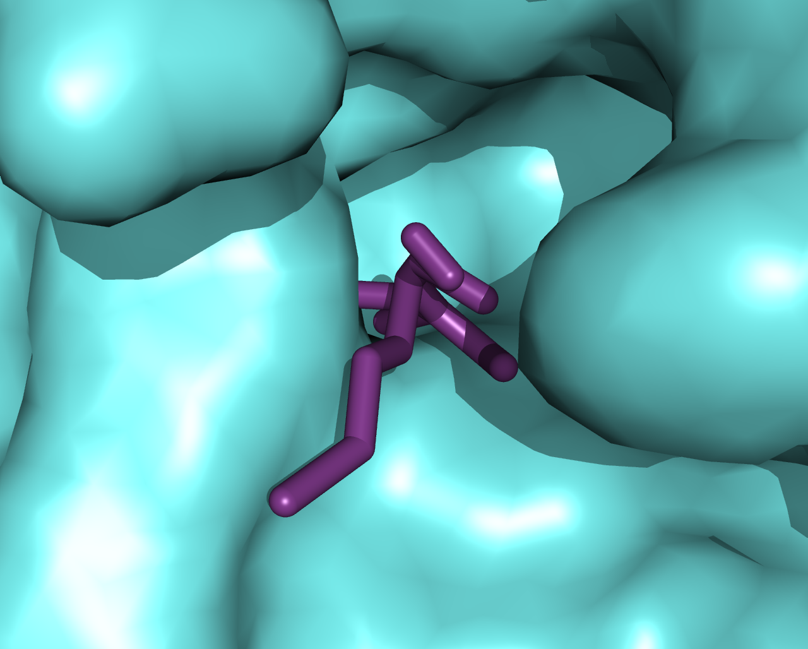  |

## 4. Off-target Effect Pre-experiment (Waiting)

For exploring that if the molecules generated by the current model suffer from the
off-target effect (i.e., the molecules for the target pocket would more likely bind
with other pockets.), we conduct the pre-experiment to check. The pre-experiment
comprises of 2 steps.

2.1. Calculating All Docking Scores between Generated Molecules and Pockets.

```bash
cd evaluation            
python off_target_demo.py
```

After calculating all the vina scores in `./evaluation/vina_scores.csv`, the format of calculated
data is alike as follows in this file.

| exp_id | sdf_id | pdb_id |            exp_dir            |            ligand             |           receptor            |  original pair  |  Best affinity  |         RMSD         |  data_i  |  pock_id  |
|:------:|:------:|:------:|:-----------------------------:|:-----------------------------:|:-----------------------------:|:---------------:|:---------------:|:--------------------:|:--------:|:---------:|
|   0    | 0      | 0      | sample_0_2023_11_20__09_32_23 |   BSD_ASPTE_1_130_0/xxx.sdf   |   BSD_ASPTE_1_130_0/xxx.pdb   |        1        |      -3.2       |  13.291612914122291  |    0     |     0     |
|   0    | 0      | 1      | sample_0_2023_11_20__09_32_23 |  GLMU_STRPN_2_459_0/xxx.sdf   |  GLMU_STRPN_2_459_0/xxx.pdb   |        0        |      -2.7       |  36.15741325727949   |    0     |     1     |
|   0    | 0      | 2      | sample_0_2023_11_20__09_32_23 |  GRK4_HUMAN_1_578_0/xxx.sdf   |  GRK4_HUMAN_1_578_0/xxx.pdb   |        0        |      -2.4       |  70.85780670795269   |    0     |     2     |
|   0    | 0      | 3      | sample_0_2023_11_20__09_32_23 |  GSTP1_HUMAN_2_210_0/xxx.sdf  |  GSTP1_HUMAN_2_210_0/xxx.pdb  |        0        |      -2.5       |  84.29126893824917   |    0     |     3     |
|   0    | 0      | 4      | sample_0_2023_11_20__09_32_23 |  GUX1_HYPJE_18_451_0/xxx.sdf  |  GUX1_HYPJE_18_451_0/xxx.pdb  |        0        |      -3.0       |  27.16143236106814   |    0     |     4     |
|   0    | 0      | 5      | sample_0_2023_11_20__09_32_23 |  HDAC8_HUMAN_1_377_0/xxx.sdf  |  HDAC8_HUMAN_1_377_0/xxx.pdb  |        0        |      -3.2       |  111.34468292669634  |    0     |     5     |
|   0    | 0      | 6      | sample_0_2023_11_20__09_32_23 |  HDHA_ECOLI_1_255_0/xxx.sdf   |  HDHA_ECOLI_1_255_0/xxx.pdb   |        0        |      -2.9       |  112.83353031913991  |    0     |     6     |
|   0    | 0      | 7      | sample_0_2023_11_20__09_32_23 |   HMD_METJA_1_358_0/xxx.sdf   |   HMD_METJA_1_358_0/xxx.pdb   |        0        |      -2.8       |  80.91813502695776   |    0     |     7     |
|   0    | 0      | 8      | sample_0_2023_11_20__09_32_23 |  CCPR_YEAST_69_361_0/xxx.sdf  |  CCPR_YEAST_69_361_0/xxx.pdb  |        0        |      -3.0       |  118.56201263074658  |    0     |     8     |
|   0    | 0      | 9      | sample_0_2023_11_20__09_32_23 |  IPMK_HUMAN_49_416_0/xxx.sdf  |  IPMK_HUMAN_49_416_0/xxx.pdb  |        0        |      -2.5       |  82.66019252936337   |    0     |     9     |
|   0    | 1      | 0      | sample_0_2023_11_20__09_32_23 |   BSD_ASPTE_1_130_0/xxx.sdf   |   BSD_ASPTE_1_130_0/xxx.pdb   |        1        |      -2.9       |  3.8684796924690397  |    1     |     0     |

Further analyzing is from the statistics of this file.

2.2. Further Analyzing

...command

effect figures. (waiting FW)

## 5. Evaluating Chemical Performance of AgainstOTE

For evaluating the chemical performance of 'qed', 'sa', 'lipinski' and 'logp',

```bash
cd /evaluation
python evaluate_chem
```

By this command, the metrics are calculated. 

|Methods | QED| SA | LogP | Lipinski |
|:----------:|:-------:|:--------:|:--------:|:------:|
|Test set |	0.483±0.23 |	0.710±0.15 |	0.932±2.71 |	4.373±1.17 |
|LiGAN |	0.395±0.24 |	0.612±0.18 |	-0.126±2.58 |	4.013±1.25 |
|AR |	0.489±0.21 |	0.676±0.17 |	0.261±2.33 |	4.757±0.42 |
|GraphBP |	0.471±0.18 |	0.706±0.25 |	0.439±2.05 |	4.776±0.45 |
|Pocket2Mol |	0.522±0.23 |	0.733±0.22 |	1.215±2.39 |	4.896±0.24 |
|FLAG |	0.495±0.17 |	0.745±0.16 |	0.630±2.38 |	4.943±0.14 |
|AgainstOTE |	0.556±0.14 |	0.664±0.15 |	1.856±1.74 |	4.985±0.12 |

For evaluating the attributes like 'hba', 'hbd', 'mw' and 'tpsa', 

```bash
cd /evaluation
python evaluate_MW
```

## 6. Target-to-Sidelobe Ratio Calculation (waiting copy and finished)

To calculate TSR (Target-to-Sidelobe Ratio), the docking scores are calculated as first,

```bash
cd /evaluation
python evaluate_chem
```

This process generates the file whose format is alike as in the `.csv` file in 3.1.

For calculating TSR, please continue to 

```bash
cd /evaluation
python data_ana...TSR.py
```

| Methods |	Affinity-Target ↓	| Affinity-OffTarget ↑	| TSR ↑ |
|:----------:|:-------:|:--------:|:--------:|
| Baseline |	-9.318±0.202 |	-10.626±0.564 |	0.266 |
| AgainstOTE |	-6.994±0.213 |	-7.58±0.340 |	0.365| 

## 7. Target-Pocket Molecule Generation

To generate ligands for designated pocket, you need to provide the `PDB` structure file of the protein, the `center coordinate` of the pocket bounding box.

Example:

```bash
python sample_for_pdb.py \
      --pdb_path ./data/crossdocked_pocket10/CCPR_YEAST_69_361_0/1a2g_A_rec_4jmv_1ly_lig_tt_min_0_pocket10.pdb
      --center " -23.3338,25.1579,-2.0340"
```

Examples of generated molecules are as below. 

|                   example 1                   |                   example 2                   |                   example 3                   |                   example 4                   |
|:---------------------------------------------:|:---------------------------------------------:|:---------------------------------------------:|:---------------------------------------------:|
| 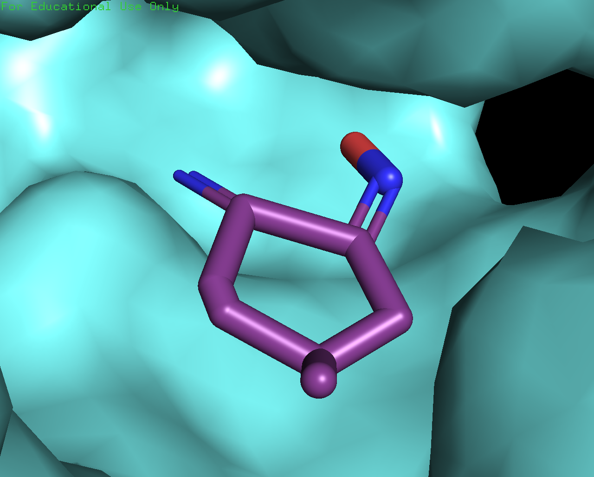   | 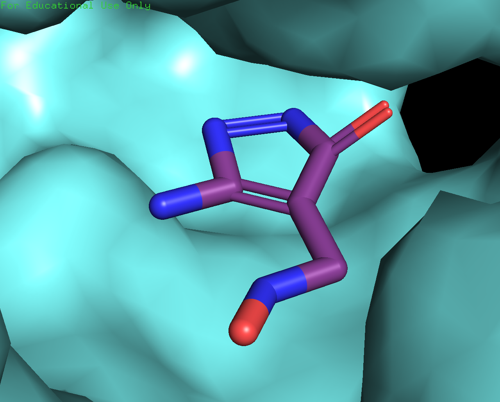   |  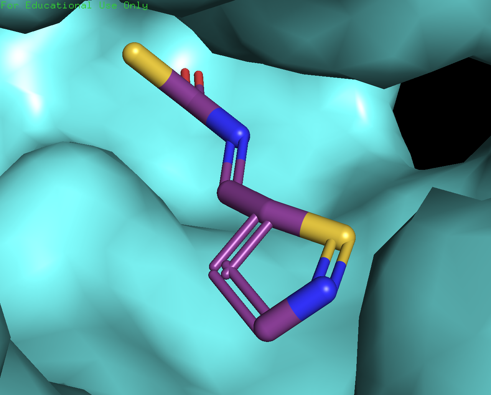  | 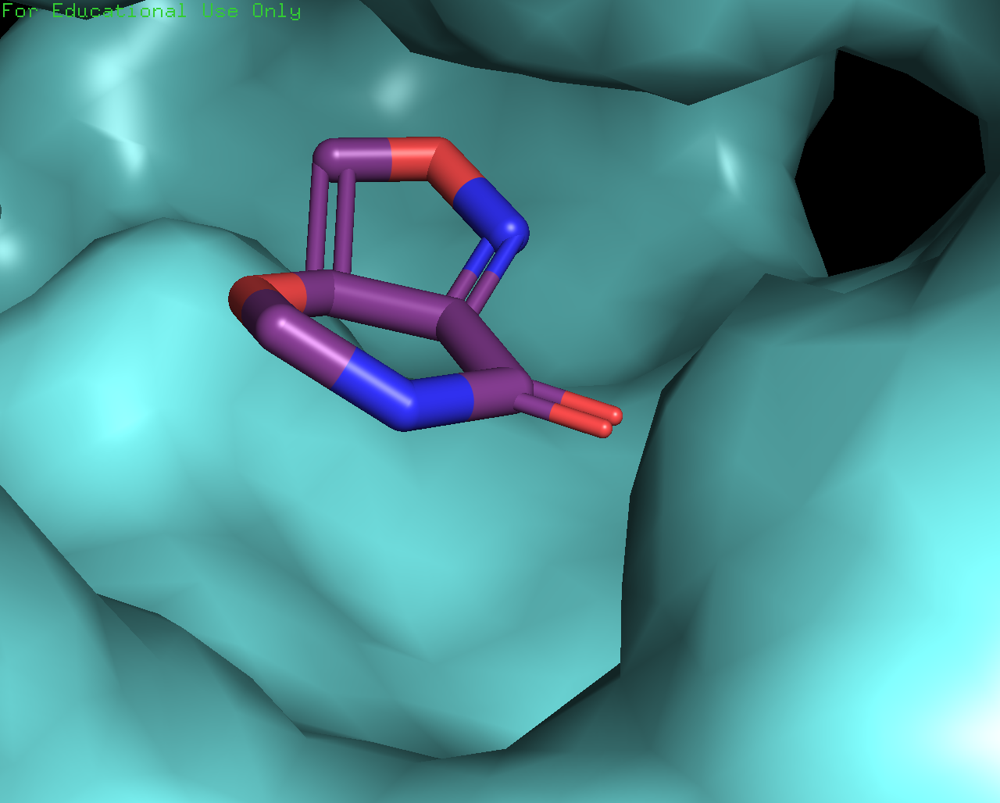  |
|                   example 5                   |                   example 6                   |                   example 7                   |                   example 8                   |
| 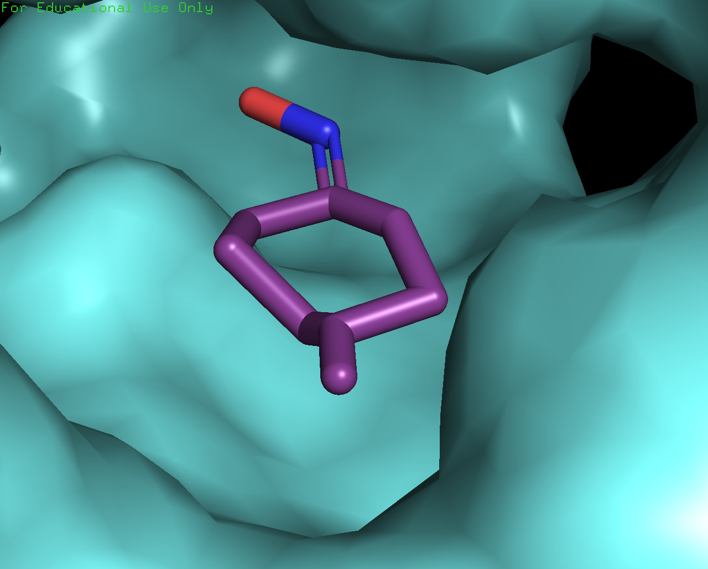  | 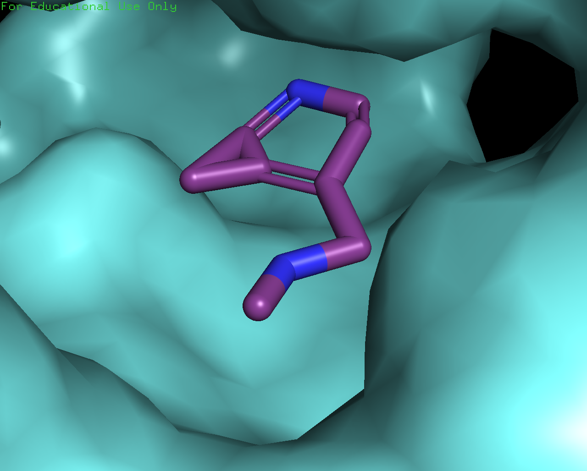  | 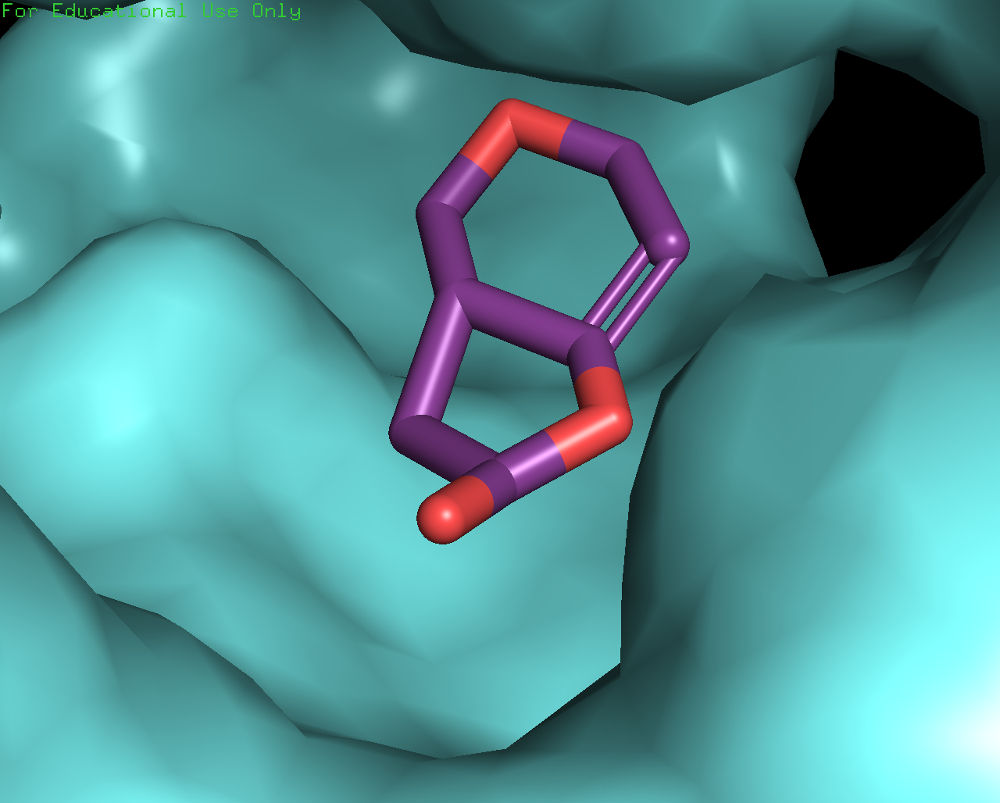  | 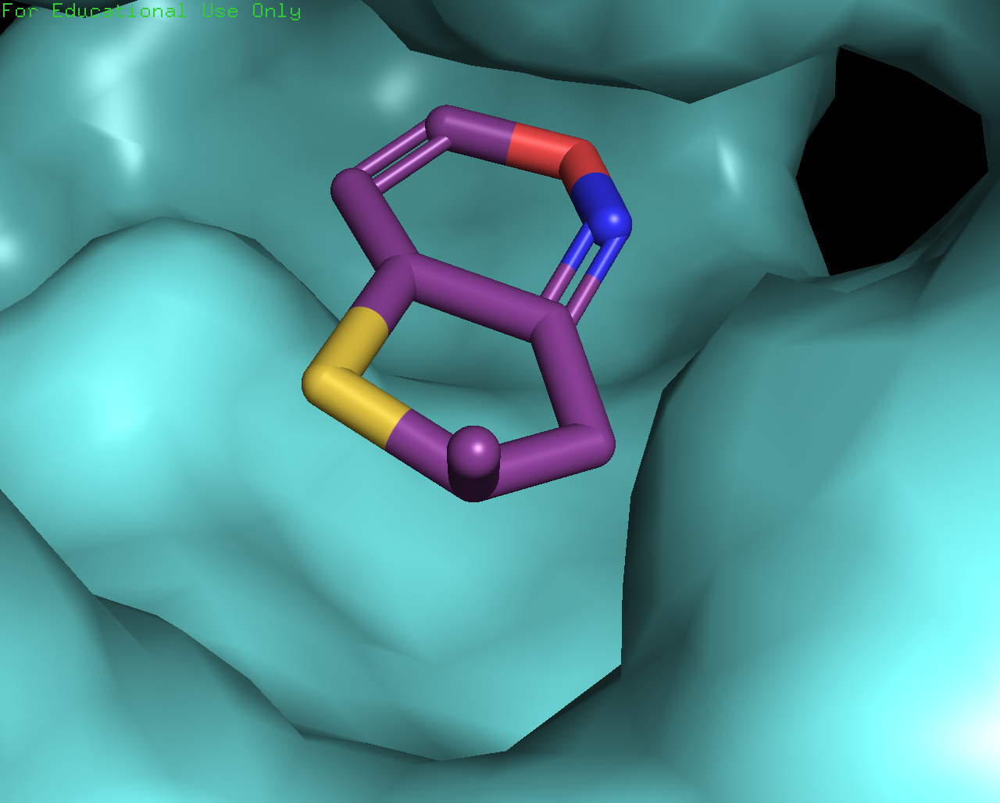  |


## 8. Training

For reproducing the procedure of training, please run with

```bash
python train_v3.py
```

## License

The model is licensed under the [Apache 2.0 license](LICENSE).


## Citation
```

```

## Contact 

